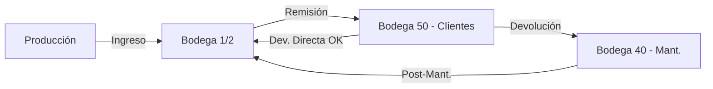
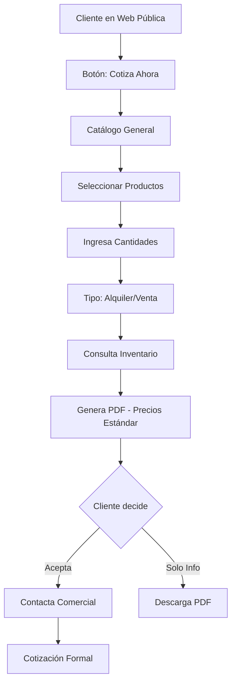
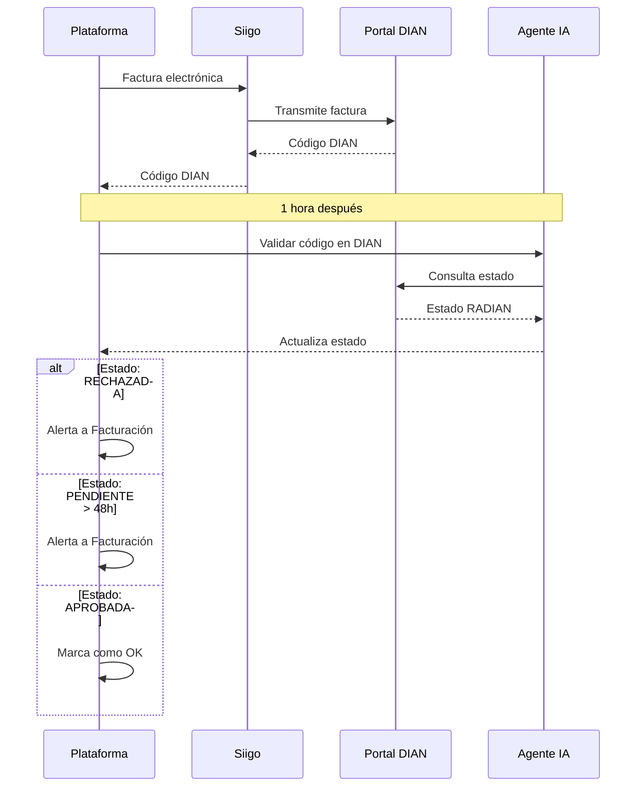
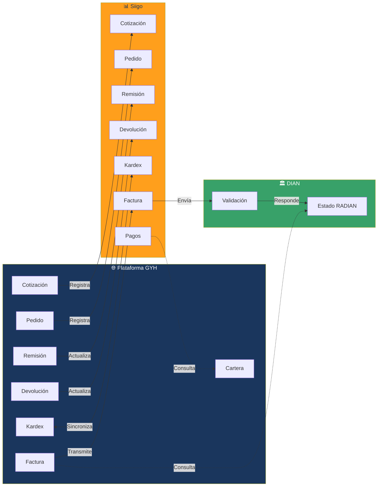
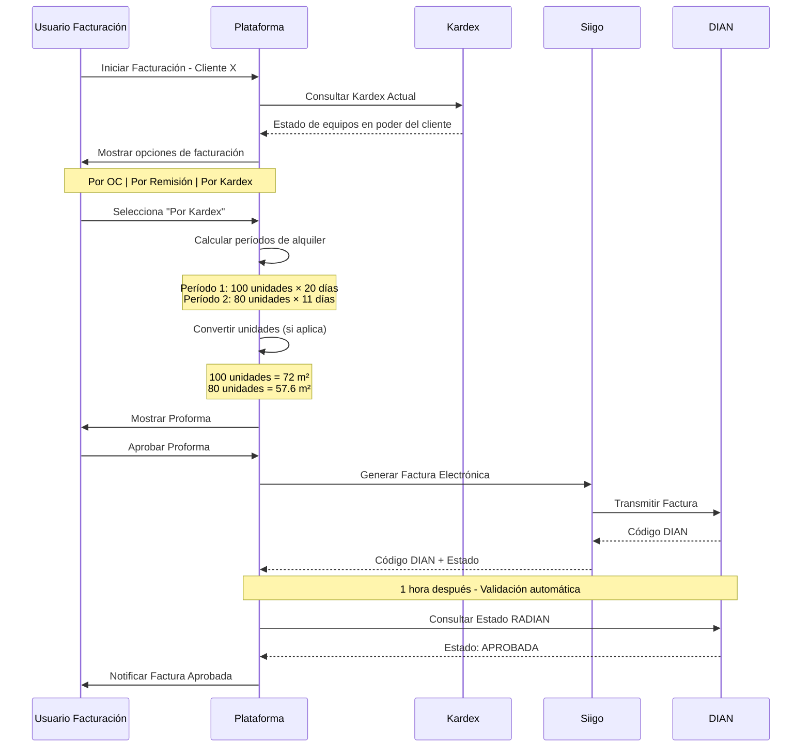
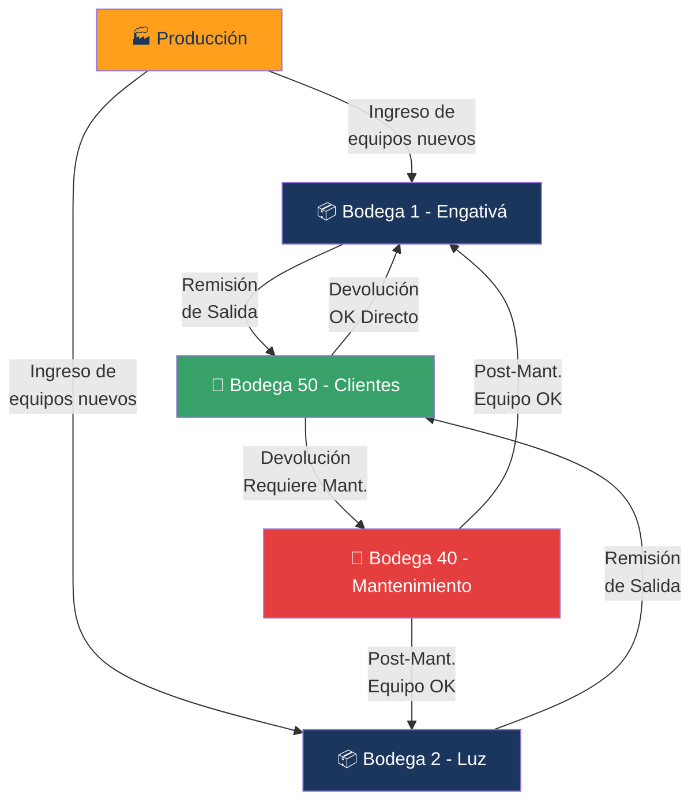
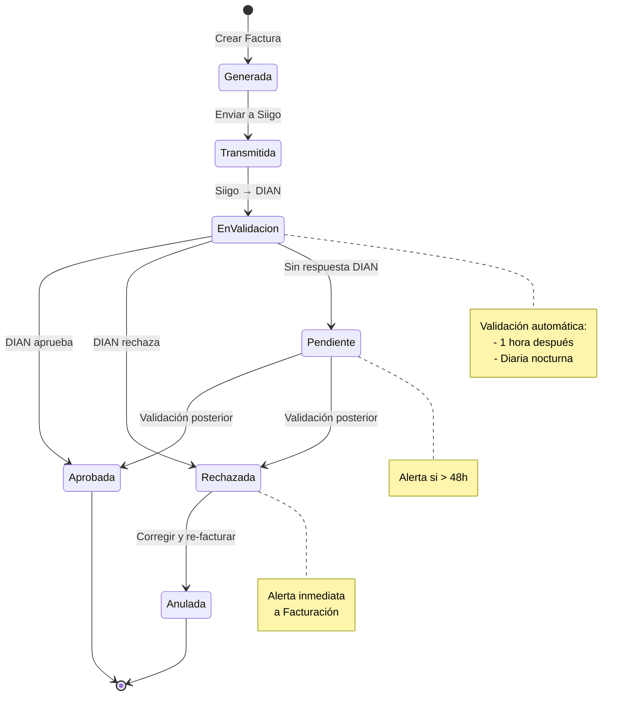
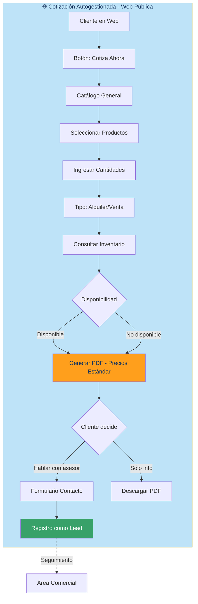

# PLAN DE TRABAJO - MEJORAS Y CORRECCIONES
## Basado en Feedback del 16 de Julio 2026

---

## 📋 RESUMEN EJECUTIVO

Este plan de trabajo consolida las mejoras, correcciones y nuevas funcionalidades identificadas en las sesiones de feedback del 16 de julio de 2026. El plan aborda tanto actualizaciones a la **documentación técnica** (especificaciones, diagramas .mmd) como al **prototipo funcional** de la plataforma GYH.

### Áreas de Impacto
- ✅ Módulo de Facturación (mejora crítica)
- ✅ Módulo de Cotizaciones (nueva funcionalidad de autogestión)
- ✅ Gestión de Roles y Permisos (nuevo rol de soporte)
- ✅ Integración con Siigo (especificaciones detalladas)
- ✅ Validación DIAN/Radian (automatización)
- ✅ Inventarios y Bodegas (consulta no restrictiva)
- ✅ Sistema de Alertas (pedidos incompletos)

---

## 🎯 MEJORAS IDENTIFICADAS

### 1. FACTURACIÓN BASADA EN KARDEX DETALLADO

**Problema Actual:**
- La facturación no muestra el detalle granular del kardex
- No se puede facturar parcialmente según lo que el cliente tenga en su poder
- Proceso manual de "punteo" que genera retrabajos

**Solución Propuesta:**
- Integrar vista detallada del kardex en el módulo de facturación
- Permitir facturación por:
  - Orden de compra completa
  - Remisión completa
  - Solo lo que está en poder del cliente (kardex actual)
- Mostrar en la factura:
  - Cantidad de producto
  - Fecha de inicio (salida/remisión)
  - Fecha de terminación (devolución parcial o total)
  - Discriminación automática de devoluciones parciales

**Ejemplo de Flujo:**
```
Pedido: 100 formaletas - Salida: 01/ENE
Devolución parcial: 20 formaletas - Fecha: 20/ENE
Estado actual: 80 formaletas

Factura debe mostrar:
- 100 formaletas × 20 días × $1,000/día = $2,000,000
- 80 formaletas × 11 días × $1,000/día = $880,000
Total: $2,880,000
```

---

### 2. CONVERSIÓN AUTOMÁTICA DE UNIDADES

**Problema Actual:**
- Productos se registran en el kardex por UNIDAD
- Facturación de ciertos productos es por METRO CUADRADO
- Conversión manual genera errores

**Solución Propuesta:**
- Crear campo de configuración por producto: "Unidad de Medida de Facturación"
  - Opciones: UNIDAD | METRO_CUADRADO
- Para productos con facturación por m²:
  - Almacenar dimensiones del producto (ancho × alto)
  - Cálculo automático: Cantidad × (Ancho × Alto) = m² totales
- Mostrar en factura tanto unidades como m² equivalentes

**Ejemplo:**
```
Producto: Formaleta 60×90
Cantidad kardex: 100 unidades
Conversión: 100 × (0.60m × 0.90m) = 72 m²
Factura: 72 m² × $X/m² = Total
```

**Parámetros del Producto:**
- Código
- Nombre
- Unidad de medida kardex: UNIDAD
- Unidad de medida facturación: METRO_CUADRADO
- Ancho (m)
- Alto (m)
- Fórmula: AUTO (área) | CUSTOM

---

### 3. NUEVO ROL: SOPORTE DE ATENCIÓN AL CLIENTE

**Problema Actual:**
- Registro de clientes depende 100% de una persona (Viviana)
- Cuello de botella operativo
- Riesgo de dependencia crítica

**Solución Propuesta:**
- Crear nuevo rol: **"Soporte Atención al Cliente"**
- Permisos específicos:
  - ✅ Registrar nuevos clientes (con documentación completa)
  - ✅ Generar pedidos para clientes ya aprobados
  - ✅ Consultar estado de aprobaciones
  - ❌ NO puede aprobar/rechazar clientes
  - ❌ NO tiene acceso a módulos financieros

**Flujos Habilitados:**
1. **Autogestión del Cliente**: Cliente se registra directamente desde la web
2. **Soporte Comercial**: El comercial registra al cliente durante la visita
3. **Soporte Atención**: Personal de atención apoya en registro telefónico/presencial

---

### 4. SISTEMA DE ALERTAS - PEDIDOS INCOMPLETOS

**Problema Actual:**
- No hay visibilidad de pedidos incompletos
- Cliente puede no estar enterado de envíos parciales
- Problemas en obra por falta de equipos completos

**Solución Propuesta:**
- Dashboard con KPIs de estado de pedidos:
  - ✅ Pedidos Completos: X
  - ⚠️ Pedidos Incompletos: Y
  - 🔴 Pedidos Pendientes: Z
- Alertas automáticas dirigidas a:
  - Área Comercial (responsable del cliente)
  - Cliente (notificación de envío incompleto)
- Detalle del pedido incompleto:
  - ¿Qué falta?
  - ¿Cuándo se puede completar?
  - ¿Alternativas disponibles?

**Flujo de Alerta:**
```
Pedido: 100 formaletas + 50 andamios
Remisión 1: 100 formaletas (completo)
Remisión 2: 30 andamios (incompleto - faltan 20)

→ ALERTA a Comercial y Cliente
  "Pedido #12345 - IH Bogotá - INCOMPLETO"
  "Enviado: 30/50 andamios. Pendiente: 20 unidades"
  "Fecha estimada: [indicar]"
```

---

### 5. COTIZACIÓN AUTOMÁTICA / AUTOGESTIÓN

**Problema Actual:**
- Cotización 100% manual
- Requiere disponibilidad de dibujante y comercial
- Cliente no puede obtener cotización inmediata

**Solución Propuesta:**
- Nuevo flujo en la **página web pública**:
  - Cliente accede sin login
  - Selecciona productos del catálogo general
  - Ingresa cantidades y duración (si es alquiler)
  - Sistema consulta inventario (sin bloquear disponibilidad)
  - Genera PDF de cotización con precios estándar
  - Disclaimer: "Precios sujetos a confirmación con asesor comercial"
- **NO reemplaza cotización personalizada**, es un "abrebocas"
- Cotización generada se almacena con estado "AUTOGESTIONADA"
- Comercial puede convertirla en cotización formal si cliente lo solicita

**Flujo Propuesto:**
```
Web Pública
  → Botón "Cotiza Ahora"
  → Selector de productos (catálogo general)
  → Cantidades y tipo (alquiler/venta)
  → Consulta inventario (indicativo)
  → PDF con precio estándar
  → Opción: "Hablar con asesor" → Contacto con comercial
```

**Importante:**
- Precios son de tabla estándar (NO precios especiales)
- Disponibilidad es INDICATIVA (no reserva productos)
- Genera lead para seguimiento comercial

---

### 6. INVENTARIOS CONSULTIVOS (NO RESTRICTIVOS)

**Problema Actual:**
- Inventarios en Siigo existen pero no son 100% precisos
- Producción puede tener equipos no registrados aún
- Sistema no puede bloquear ventas por inventario

**Solución Propuesta:**
- Módulo de inventarios con **modo consultivo**:
  - Muestra disponibilidad actual en bodegas
  - NO bloquea creación de pedidos si no hay stock
  - Genera advertencia: "Disponibilidad insuficiente - Contactar producción"
- Roles que pueden consultar inventarios:
  - Gerencia (todas las bodegas)
  - Comerciales (todas las bodegas)
  - Producción (bodegas 1, 2, 40)
  - Almacén (todas las bodegas)

**Bodegas del Sistema:**
- **Bodega 1**: Engativá (principal)
- **Bodega 2**: Engativá - Luz
- **Bodega 40**: Mantenimiento (equipos en revisión)
- **Bodega 50**: Clientes (equipos en poder del cliente)

**Flujo de Movimiento:**
```
Producción → Bodega 1/2
Remisión: Bodega 1/2 → Bodega 50 (Cliente)
Devolución: Bodega 50 → Bodega 40 (Mantenimiento)
Post-Mant: Bodega 40 → Bodega 1/2
```

---

## 🔧 CORRECCIONES NECESARIAS

### 1. INTEGRACIÓN CON SIIGO - ESPECIFICACIÓN COMPLETA

**Puntos de Integración Identificados:**

#### A. COTIZACIÓN → SIIGO
- **Dirección**: Plataforma → Siigo
- **Momento**: Al generar cotización formal
- **Datos**: Código cotización, cliente, productos, valores
- **Respuesta**: Confirmación de registro en Siigo

#### B. PEDIDO → SIIGO
- **Dirección**: Plataforma → Siigo
- **Momento**: Al crear pedido (cliente aprobado)
- **Datos**: Código pedido, cliente, productos, cantidades, tipo de negocio
- **Respuesta**: Código de pedido Siigo

#### C. REMISIÓN → SIIGO (CRÍTICO)
- **Dirección**: Plataforma → Siigo
- **Momento**: Al generar remisión de salida
- **Datos**:
  - Código remisión
  - Pedido asociado
  - Cliente
  - Productos y cantidades despachadas
  - Bodega origen → Bodega destino (50 - Clientes)
  - Conductor asignado
- **Efecto**: Actualiza kardex en Siigo y Plataforma
- **Respuesta**: Confirmación y nuevo estado de inventario

#### D. DEVOLUCIÓN → SIIGO (CRÍTICO)
- **Dirección**: Plataforma → Siigo
- **Momento**: Al registrar devolución de equipos
- **Datos**:
  - Código devolución
  - Remisión asociada
  - Cliente
  - Productos y cantidades devueltas
  - Estado del equipo (OK, Mantenimiento, Baja)
  - Bodega destino (40 - Mantenimiento o 1/2 - Disponible)
- **Efecto**: Actualiza kardex en Siigo y Plataforma
- **Respuesta**: Confirmación y nuevo estado de inventario

#### E. KARDEX - SINCRONIZACIÓN BIDIRECCIONAL
- **Dirección**: Bidireccional (debe coincidir)
- **Momento**: Continuo
- **Validación**: Estado del kardex debe ser IDÉNTICO en Plataforma y Siigo
- **Balance**: Suma de todas las bodegas = Total inventario

#### F. FACTURA → SIIGO → DIAN
- **Dirección**: Plataforma → Siigo → DIAN
- **Momento**: Al generar factura (post-aprobación de proforma)
- **Datos**:
  - Código factura
  - Cliente
  - Productos, cantidades, fechas (inicio/fin)
  - Valores calculados (con conversión de unidades)
  - Centro de costo (13=Alquiler, 14=Venta/Repos)
  - Impuestos (IVA, Rte.Fuente, ReteICA, ReteTrans)
- **Flujo**:
  1. Plataforma → Siigo (factura)
  2. Siigo → DIAN (transmisión electrónica)
  3. DIAN → Siigo (respuesta con código)
- **Respuesta**: Código de factura Siigo

#### G. VALIDACIÓN RADIAN - DIAN → PLATAFORMA
- **Dirección**: Plataforma consulta DIAN
- **Momento**: Post-facturación (automático nocturno o manual)
- **Proceso**:
  1. Plataforma obtiene código de factura Siigo
  2. Con código, consulta estado en portal DIAN
  3. DIAN responde: APROBADA | RECHAZADA | PENDIENTE
  4. Plataforma actualiza estado de factura
- **Importante**: Estado en Siigo NO es confiable, siempre validar en DIAN

#### H. CARTERA - SIIGO → PLATAFORMA
- **Dirección**: Siigo → Plataforma
- **Momento**: Automático nocturno (diario)
- **Proceso**:
  1. Plataforma consulta pagos en Siigo
  2. Siigo responde con movimientos de pago
  3. Plataforma cruza con facturas emitidas
  4. Actualiza estado de cartera
- **Datos**: Factura, cliente, fecha de pago, monto, saldo pendiente

---

### 2. VALIDACIÓN RADIAN - AUTOMATIZACIÓN

**Problema Actual:**
- Estado de factura en Siigo puede no reflejar el estado real en DIAN
- Validación manual en portal DIAN es lenta y propensa a errores

**Solución con IA:**
- **Proceso Automatizado**:
  1. Sistema obtiene código de factura de Siigo
  2. Agente de IA accede al portal DIAN
  3. Consulta estado de factura (RADIAN)
  4. Extrae estado: APROBADA | RECHAZADA | PENDIENTE
  5. Actualiza estado en Plataforma
- **Frecuencia**:
  - Inmediata: 1 hora después de facturar
  - Diaria: Revisión nocturna de todas las facturas pendientes
- **Alertas**:
  - Si factura RECHAZADA → Alerta a Facturación
  - Si factura PENDIENTE > 48h → Alerta a Facturación

**Especificación Técnica:**
- Portal DIAN: [URL del portal RADIAN]
- Credenciales: A definir (o scraping web)
- Datos de entrada: Código de factura DIAN
- Datos de salida: Estado, fecha de validación, observaciones

---

## 📚 ACTUALIZACIONES A LA DOCUMENTACIÓN

### 1. Crear: `07_integracion_siigo.mmd`

**Contenido:**
- Diagrama de secuencia de integraciones
- Flujo completo: Cotización → Pedido → Remisión → Devolución → Kardex → Factura → DIAN → Cartera
- Especificación de cada punto de integración:
  - Endpoint (si aplica)
  - Datos de entrada
  - Datos de salida
  - Manejo de errores
  - Rollback (si aplica)

**Formato:**
```mermaid
sequenceDiagram
    participant P as Plataforma GYH
    participant S as Siigo
    participant D as DIAN

    P->>S: Crear Cotización
    S-->>P: Código Cotización

    P->>S: Crear Pedido
    S-->>P: Código Pedido

    P->>S: Registrar Remisión
    S-->>P: Actualizar Kardex

    ... [continuar flujo completo]
```

---

### 2. Actualizar: `06_roles_y_permisos_tabla.md`

**Nuevo Rol a Incluir:**

| Rol | Módulo | Permiso | Notas |
|-----|--------|---------|-------|
| Soporte Atención Cliente | Clientes | Registrar nuevo cliente | Solo con documentación completa |
| Soporte Atención Cliente | Clientes | Ver estado de aprobación | Solo lectura |
| Soporte Atención Cliente | Pedidos | Crear pedido | Solo para clientes YA aprobados |
| Soporte Atención Cliente | Cotizaciones | Ver cotizaciones | Solo del cliente que está atendiendo |
| Soporte Atención Cliente | Facturación | ❌ Sin acceso | - |
| Soporte Atención Cliente | Cartera | ❌ Sin acceso | - |
| Soporte Atención Cliente | Inventarios | Consultar disponibilidad | Solo vista consultiva |

**Actualizar Permisos de Inventarios:**

| Rol | Consultar Inventario | Bodegas Visibles | Puede Modificar |
|-----|---------------------|------------------|-----------------|
| Gerencia | ✅ | Todas (1, 2, 40, 50) | ❌ |
| Comercial | ✅ | Todas (1, 2, 40, 50) | ❌ |
| Producción | ✅ | 1, 2, 40 (no ve clientes) | ❌ |
| Almacén | ✅ | Todas (1, 2, 40, 50) | ✅ (solo mov. físicos) |
| Soporte Atención | ✅ | 1, 2, 50 (no ve mantenimiento) | ❌ |

---

### 3. Crear: `08_modulo_kardex_facturacion.mmd`

**Contenido:**
- Flujo detallado de facturación con kardex
- Lógica de conversión de unidades
- Cálculo de días de alquiler con devoluciones parciales
- Estructura de datos del kardex

**Ejemplo de Estructura:**
```
KARDEX por Cliente y Producto
- Producto: Formaleta 60×90
- Cliente: IH Bogotá
- Movimientos:
  [SALIDA] 01/ENE - 100 unidades - Remisión #001
  [DEVOL] 20/ENE - 20 unidades - Remisión #002
  [DEVOL] 31/ENE - 80 unidades - Remisión #003

Estado para Facturación:
- Período 1: 01/ENE - 20/ENE → 100 unidades × 20 días
- Período 2: 21/ENE - 31/ENE → 80 unidades × 11 días

Conversión:
- 100 unidades = 72 m² (período 1)
- 80 unidades = 57.6 m² (período 2)
```

---

### 4. Crear: `09_bodegas_inventarios.mmd`

**Contenido:**
- Flujo de movimiento entre bodegas
- Lógica de actualización de inventario
- Consulta consultiva (no restrictiva)
- Dashboard de inventarios

**Flujo de Bodegas:**


---

### 5. Actualizar: `03_modulo_cotizacion.mmd`

**Agregar:**
- Flujo de cotización autogestionada desde web pública
- Diferenciación entre:
  - Cotización autogestionada (precios estándar)
  - Cotización comercial (precios personalizados)
  - Cotización formal (para pedido)

**Flujo Propuesto:**


---

### 6. Crear: `10_validacion_dian_radian.mmd`

**Contenido:**
- Flujo de validación automática RADIAN
- Proceso con IA para consulta en portal DIAN
- Estados posibles y acciones
- Sistema de alertas

**Flujo:**


---

## 🎨 ACTUALIZACIONES AL PROTOTIPO

### 1. Módulo de Facturación

**Nuevas Vistas:**

#### A. Vista de Pre-facturación con Kardex
- Selector: "¿Cómo desea facturar?"
  - [ ] Por orden de compra completa
  - [ ] Por remisión específica
  - [ ] Por kardex actual (solo lo que tiene el cliente)
- Tabla de kardex detallado:
  - Producto
  - Cantidad inicial (remisión)
  - Fecha salida
  - Devoluciones parciales (con fechas)
  - Cantidad actual en poder del cliente
  - Días de alquiler por período
  - Unidad de facturación (unidad o m²)
- Botón: "Generar Proforma"

#### B. Vista de Proforma
- Detalle de cobros discriminados:
  - Período 1: [fechas] - [cantidad] - [días] - [valor]
  - Período 2: [fechas] - [cantidad] - [días] - [valor]
  - ...
- Conversión de unidades visible:
  - "100 formaletas = 72 m² × $X/m² = $Y"
- Totales parciales y finales
- Centro de costo
- Impuestos discriminados
- Botón: "Enviar a Cliente" | "Editar"

#### C. Vista de Validación DIAN
- Estado de factura:
  - ⏳ Pendiente de transmisión
  - 🔄 Transmitida - En validación
  - ✅ Aprobada DIAN
  - ❌ Rechazada DIAN
- Código DIAN
- Fecha de validación
- Observaciones (si aplica)
- Botón: "Validar Ahora" (manual)

---

### 2. Módulo de Cotizaciones

**Nueva Vista: Cotización Autogestionada**

#### Página Web Pública (sin login)
- Hero Section con botón: "Cotiza tu Proyecto"
- Flujo del cotizador:
  1. **Paso 1**: Selección de productos del catálogo
     - Filtros: Línea de negocio (FM, FP/FT, Multi, etc.)
     - Búsqueda por nombre/código
     - Vista de productos con imagen y descripción
  2. **Paso 2**: Cantidades y tipo
     - Cantidad de cada producto
     - Tipo de negocio: Alquiler | Venta
     - Si alquiler: Duración estimada (días)
  3. **Paso 3**: Consulta de disponibilidad
     - Indicador por producto:
       - ✅ Disponible (más de X unidades)
       - ⚠️ Disponibilidad limitada
       - ⏳ Consultar con asesor (no hay stock)
  4. **Paso 4**: Resumen y cotización
     - Productos seleccionados
     - Precios de tabla estándar
     - Total estimado
     - Disclaimer: "Precios referenciales. Consulta con tu asesor para precios finales."
  5. **Paso 5**: Descarga PDF o Contacto
     - Botón: "Descargar Cotización (PDF)"
     - Botón: "Hablar con un Asesor" → Formulario de contacto

#### Dashboard de Comercial
- Nueva sección: "Cotizaciones Autogestionadas"
- Lista de cotizaciones generadas desde web pública
- Botón: "Convertir en Cotización Formal"

---

### 3. Módulo de Clientes

**Nueva Funcionalidad: Registro Múltiple**

#### A. Autogestión del Cliente
- Formulario público de registro
- Carga de documentos (RUT, Cámara de Comercio, etc.)
- Estado inicial: "En Revisión"
- Notificación al equipo de aprobación

#### B. Registro por Soporte Atención
- Nuevo rol en el sistema con permisos específicos
- Vista de registro idéntica a la de comercial
- Diferencia: No puede aprobar, solo registrar
- Checklist de documentos requeridos
- Validación de que todos los campos estén completos

#### C. Dashboard de Aprobaciones
- Filtro adicional: "Registrado por"
  - Comercial
  - Soporte Atención
  - Autogestión Cliente
- Indicador visual del origen del registro

---

### 4. Módulo de Inventarios

**Nueva Vista: Consulta de Inventarios (Consultiva)**

#### A. Dashboard de Inventarios
- Vista por bodega:
  - Bodega 1 (Engativá)
  - Bodega 2 (Engativá - Luz)
  - Bodega 40 (Mantenimiento)
  - Bodega 50 (Clientes)
- Totales por producto
- Búsqueda por código o nombre

#### B. Detalle por Producto
- Cantidad en cada bodega
- Movimientos recientes (últimos 30 días):
  - Entradas
  - Salidas (remisiones)
  - Devoluciones
  - Mantenimiento
- Gráfico de tendencia

#### C. Consulta en Pedidos/Cotizaciones
- Al crear pedido o cotización:
  - Botón: "Consultar Disponibilidad"
  - Modal con inventario actual
  - Advertencia si no hay stock suficiente:
    - ⚠️ "Disponibilidad insuficiente. Contacte a Producción."
  - NO bloquea la creación del pedido

---

### 5. Módulo de Pedidos/Almacén

**Nueva Vista: Alertas de Pedidos Incompletos**

#### A. Dashboard de Pedidos
- Nuevos KPIs en la parte superior:
  - ✅ Pedidos Completos: [número]
  - ⚠️ Pedidos Incompletos: [número]
  - 🔴 Pedidos Pendientes de Despacho: [número]
- Clic en "Pedidos Incompletos" → Detalle

#### B. Vista de Pedidos Incompletos
- Tabla con:
  - Cliente
  - Número de pedido
  - Fecha de pedido
  - ¿Qué falta? (productos y cantidades)
  - Responsable comercial
  - Botón: "Enviar Alerta al Cliente"
- Filtros:
  - Por cliente
  - Por comercial
  - Por antigüedad (> 7 días, > 15 días, etc.)

#### C. Notificaciones Automáticas
- Al marcar remisión como "Incompleta":
  - Alerta automática a:
    - Comercial responsable
    - Cliente (email + notificación en plataforma)
  - Contenido:
    - "Su pedido #XXXX fue despachado parcialmente"
    - "Productos entregados: [lista]"
    - "Productos pendientes: [lista]"
    - "Fecha estimada de envío: [fecha]"

---

### 6. Configuración de Productos

**Nueva Vista: Configuración de Unidades de Medida**

#### Formulario de Producto (Edición)
- Campo: **Unidad de Medida en Kardex**
  - Dropdown: UNIDAD | METRO_CUADRADO | KILOGRAMO | OTRO
- Campo: **Unidad de Medida en Facturación**
  - Dropdown: UNIDAD | METRO_CUADRADO | KILOGRAMO | OTRO
- Si Kardex ≠ Facturación:
  - Mostrar sección: "Configuración de Conversión"
  - Si facturación = METRO_CUADRADO:
    - Campo: Ancho (metros)
    - Campo: Alto (metros)
    - Preview: "1 unidad = [ancho × alto] m²"
    - Ejemplo: "100 unidades = 72 m²"

---

## 🔀 ESPECIFICACIONES TÉCNICAS (.mmd)

### 1. Diagrama de Integración Siigo - Vista General

**Archivo:** `07_integracion_siigo.mmd`



---

### 2. Diagrama de Secuencia - Facturación con Kardex

**Archivo:** `08_modulo_kardex_facturacion.mmd`



---

### 3. Diagrama de Flujo - Bodegas e Inventarios

**Archivo:** `09_bodegas_inventarios.mmd`



---

### 4. Diagrama de Estados - Validación DIAN

**Archivo:** `10_validacion_dian_radian.mmd`



---

### 5. Actualización - Flujo de Cotización con Autogestión

**Archivo:** `03_modulo_cotizacion.mmd` (actualizar)

Agregar subgrafo:



---

### 6. Matriz de Roles - Nuevo Rol de Soporte

**Archivo:** `06_roles_y_permisos_tabla.md` (actualizar)

Agregar fila en la tabla principal:

```markdown
## NUEVO ROL: Soporte Atención al Cliente

| Módulo | Acción | Soporte Atención | Notas |
|--------|--------|------------------|-------|
| Clientes | Registrar nuevo cliente | ✅ | Solo con docs completos |
| Clientes | Ver estado aprobación | ✅ | Solo lectura |
| Clientes | Aprobar/Rechazar | ❌ | - |
| Pedidos | Crear pedido | ✅ | Solo clientes aprobados |
| Pedidos | Ver pedidos | ✅ | Solo de sus clientes |
| Cotizaciones | Ver cotizaciones | ✅ | Solo de sus clientes |
| Cotizaciones | Crear cotización | ❌ | Solo comercial |
| Inventarios | Consultar disponibilidad | ✅ | Bodegas 1, 2, 50 |
| Facturación | Acceso | ❌ | - |
| Cartera | Acceso | ❌ | - |
| Contratos | Ver contratos | ✅ | Solo lectura |
| Contratos | Generar contrato | ❌ | - |

## Flujos de Registro Habilitados

1. **Autogestión**: Cliente se registra desde web → Estado: En Revisión
2. **Comercial**: Comercial registra durante visita → Estado: En Revisión
3. **Soporte Atención**: Personal de soporte registra por teléfono/presencial → Estado: En Revisión

Todos los flujos convergen en el **mismo proceso de aprobación multi-área**.
```

---

## 📅 FASES DE IMPLEMENTACIÓN

### FASE 1: DOCUMENTACIÓN Y ESPECIFICACIONES (Semana 1-2)

**Objetivo:** Actualizar toda la documentación técnica con los nuevos requerimientos

**Tareas:**
1. ✅ Crear `07_integracion_siigo.mmd`
   - Diagrama de vista general
   - Secuencia de cada integración
   - Especificación de datos
2. ✅ Crear `08_modulo_kardex_facturacion.mmd`
   - Flujo de facturación con kardex
   - Lógica de conversión de unidades
   - Cálculo de períodos de alquiler
3. ✅ Crear `09_bodegas_inventarios.mmd`
   - Flujo entre bodegas
   - Consulta consultiva
   - Dashboard de inventarios
4. ✅ Crear `10_validacion_dian_radian.mmd`
   - Proceso de validación automática
   - Estados y alertas
5. ✅ Actualizar `03_modulo_cotizacion.mmd`
   - Agregar flujo de autogestión
6. ✅ Actualizar `06_roles_y_permisos_tabla.md`
   - Agregar rol de Soporte Atención
   - Actualizar permisos de inventarios

**Entregables:**
- 4 nuevos archivos .mmd
- 2 archivos .md actualizados
- Reporte HTML actualizado con nuevos diagramas

---

### FASE 2: PROTOTIPO - MÓDULO DE FACTURACIÓN (Semana 3-4)

**Objetivo:** Implementar facturación basada en kardex con conversión de unidades

**Tareas:**
1. ✅ Diseñar vista de pre-facturación con selector de tipo
2. ✅ Implementar tabla de kardex detallado
3. ✅ Desarrollar lógica de cálculo de períodos de alquiler
4. ✅ Implementar conversión automática de unidades
5. ✅ Diseñar vista de proforma con detalle discriminado
6. ✅ Implementar vista de validación DIAN
7. ✅ Configuración de productos: unidades de medida

**Entregables:**
- 3 nuevas vistas en prototipo
- Formulario de configuración de productos actualizado
- Lógica de cálculo implementada

**Casos de Prueba:**
- Facturar 100 formaletas con devolución parcial
- Conversión de unidades: 100 formaletas → 72 m²
- Múltiples períodos de alquiler en una factura

---

### FASE 3: PROTOTIPO - COTIZACIÓN AUTOGESTIONADA (Semana 5-6)

**Objetivo:** Habilitar cotización desde web pública sin login

**Tareas:**
1. ✅ Diseñar landing page con botón "Cotiza Ahora"
2. ✅ Implementar cotizador paso a paso (5 pasos)
3. ✅ Integrar consulta de inventarios (indicativa)
4. ✅ Diseñar plantilla PDF de cotización autogestionada
5. ✅ Implementar formulario de contacto ("Hablar con asesor")
6. ✅ Crear dashboard de cotizaciones autogestionadas para comerciales
7. ✅ Funcionalidad "Convertir en Cotización Formal"

**Entregables:**
- Página pública de cotización (mockup funcional)
- Generador de PDF de cotización
- Dashboard actualizado para comerciales

**Casos de Prueba:**
- Cliente genera cotización sin login
- Cliente descarga PDF
- Cliente solicita contacto con asesor
- Comercial convierte cotización autogestionada en formal

---

### FASE 4: PROTOTIPO - NUEVO ROL Y ALERTAS (Semana 7-8)

**Objetivo:** Implementar rol de Soporte Atención y sistema de alertas

**Tareas:**
1. ✅ Crear rol "Soporte Atención Cliente" en sistema
2. ✅ Configurar permisos específicos del rol
3. ✅ Adaptar vistas de registro de clientes para el nuevo rol
4. ✅ Implementar dashboard de aprobaciones con filtro de origen
5. ✅ Diseñar dashboard de pedidos con KPIs
6. ✅ Implementar vista de pedidos incompletos
7. ✅ Desarrollar sistema de notificaciones automáticas
8. ✅ Configurar alertas por email y en plataforma

**Entregables:**
- Nuevo rol funcional en prototipo
- Dashboard de pedidos con alertas
- Sistema de notificaciones operativo

**Casos de Prueba:**
- Soporte Atención registra nuevo cliente
- Soporte Atención intenta aprobar cliente (debe ser bloqueado)
- Pedido marcado como incompleto genera alerta
- Comercial y cliente reciben notificación de pedido incompleto

---

### FASE 5: PROTOTIPO - INVENTARIOS CONSULTIVOS (Semana 9-10)

**Objetivo:** Implementar módulo de inventarios no restrictivo con múltiples bodegas

**Tareas:**
1. ✅ Diseñar dashboard de inventarios por bodega
2. ✅ Implementar consulta de inventario en pedidos/cotizaciones
3. ✅ Desarrollar vista de detalle por producto
4. ✅ Implementar advertencias (no bloqueos) de disponibilidad
5. ✅ Configurar permisos de consulta por rol
6. ✅ Diseñar flujo de movimiento entre bodegas
7. ✅ Implementar gráficos de tendencia de inventario

**Entregables:**
- Dashboard de inventarios funcional
- Consulta integrada en módulos de ventas
- Sistema de advertencias (no restrictivo)

**Casos de Prueba:**
- Comercial consulta inventario antes de cotizar
- Comercial crea pedido sin stock suficiente (debe permitir con advertencia)
- Gerencia ve todas las bodegas
- Producción solo ve bodegas 1, 2, 40

---

### FASE 6: INTEGRACIÓN SIIGO - ESPECIFICACIÓN (Semana 11-12)

**Objetivo:** Definir especificaciones técnicas de integración con Siigo

**Tareas:**
1. ✅ Reunión con equipo técnico de Siigo
2. ✅ Documentar endpoints de integración
3. ✅ Definir estructura de datos para cada integración
4. ✅ Establecer flujo de manejo de errores
5. ✅ Definir proceso de sincronización de kardex
6. ✅ Especificar rollback en caso de fallas
7. ✅ Documentar API de Siigo (si aplica) o proceso de importación

**Entregables:**
- Documento técnico de integración Siigo
- Especificación de datos (input/output)
- Plan de manejo de errores
- Plan de testing de integración

**Nota:** Esta fase es de especificación, NO de desarrollo. El desarrollo se realizará en el proyecto final, no en el prototipo.

---

### FASE 7: VALIDACIÓN DIAN - ESPECIFICACIÓN (Semana 13-14)

**Objetivo:** Definir proceso de validación automática RADIAN

**Tareas:**
1. ✅ Investigar API de DIAN (si existe)
2. ✅ Definir proceso de scraping web (si no hay API)
3. ✅ Especificar agente de IA para consulta automática
4. ✅ Definir frecuencia de validación (1h post-factura + nocturna)
5. ✅ Establecer lógica de alertas según estado
6. ✅ Documentar proceso de validación manual (fallback)

**Entregables:**
- Documento de especificación de validación DIAN
- Proceso con IA documentado
- Plan de implementación

**Nota:** Esta fase es de especificación, NO de desarrollo. El desarrollo se realizará en el proyecto final.

---

### FASE 8: REVISIÓN Y VALIDACIÓN (Semana 15-16)

**Objetivo:** Validar todas las actualizaciones con el equipo GYH

**Tareas:**
1. ✅ Presentación de documentación actualizada
2. ✅ Demo del prototipo con nuevas funcionalidades
3. ✅ Sesión de feedback con equipo operativo
   - Facturación: validar flujo de kardex
   - Comerciales: validar cotización autogestionada
   - Almacén: validar alertas de pedidos incompletos
   - Gerencia: validar inventarios consultivos
4. ✅ Ajustes según feedback
5. ✅ Generación de reporte final HTML actualizado
6. ✅ Aprobación del plan de implementación

**Entregables:**
- Documentación técnica completa y aprobada
- Prototipo funcional validado
- Reporte HTML final
- Plan de implementación para desarrollo final

---

## 📊 MÉTRICAS DE ÉXITO

### Documentación
- ✅ 4 nuevos archivos .mmd creados
- ✅ 2 archivos .md actualizados
- ✅ Reporte HTML actualizado
- ✅ 100% de integraciones especificadas

### Prototipo
- ✅ Facturación con kardex funcional
- ✅ Conversión de unidades automática
- ✅ Cotización autogestionada operativa
- ✅ Nuevo rol de Soporte Atención implementado
- ✅ Sistema de alertas funcional
- ✅ Inventarios consultivos implementados

### Validación
- ✅ Aprobación del equipo operativo GYH
- ✅ Casos de prueba ejecutados exitosamente
- ✅ Feedback incorporado

---

## 🚀 PRÓXIMOS PASOS POST-PLAN

Una vez completado este plan:

1. **Desarrollo Backend** (no incluido en este plan):
   - Implementar integraciones con Siigo
   - Desarrollar API de la plataforma
   - Implementar lógica de negocio

2. **Desarrollo Frontend** (no incluido en este plan):
   - Convertir prototipo en aplicación funcional
   - Implementar UI/UX final

3. **Testing**:
   - Pruebas unitarias
   - Pruebas de integración
   - Pruebas de usuario (UAT)

4. **Despliegue**:
   - Configuración de infraestructura AWS
   - Migración de datos
   - Go-live

---

## 📞 CONTACTO Y SEGUIMIENTO

- **Responsable del Plan**: [Nombre]
- **Fecha de Inicio**: [Fecha]
- **Fecha Estimada de Finalización**: [Fecha + 16 semanas]
- **Reuniones de Seguimiento**: Semanal - [Día y Hora]
- **Canal de Comunicación**: [WhatsApp/Slack/Email]

---

## 📝 NOTAS FINALES

Este plan se enfoca en:
1. **Documentación técnica completa** para guiar el desarrollo
2. **Prototipo funcional** para validar flujos y experiencia de usuario
3. **Especificaciones de integración** para el desarrollo posterior

**NO incluye**:
- Desarrollo backend de integraciones
- Desarrollo frontend final
- Despliegue en producción

Estos elementos serán parte del proyecto de desarrollo final, posterior a la aprobación de este plan.

---

**Versión:** 1.0
**Fecha:** 17 de Julio 2026
**Estado:** Pendiente de Revisión

---

## 🔄 CONTROL DE CAMBIOS

| Versión | Fecha | Cambios | Responsable |
|---------|-------|---------|-------------|
| 1.0 | 17/JUL/2026 | Creación inicial del plan | [Nombre] |

